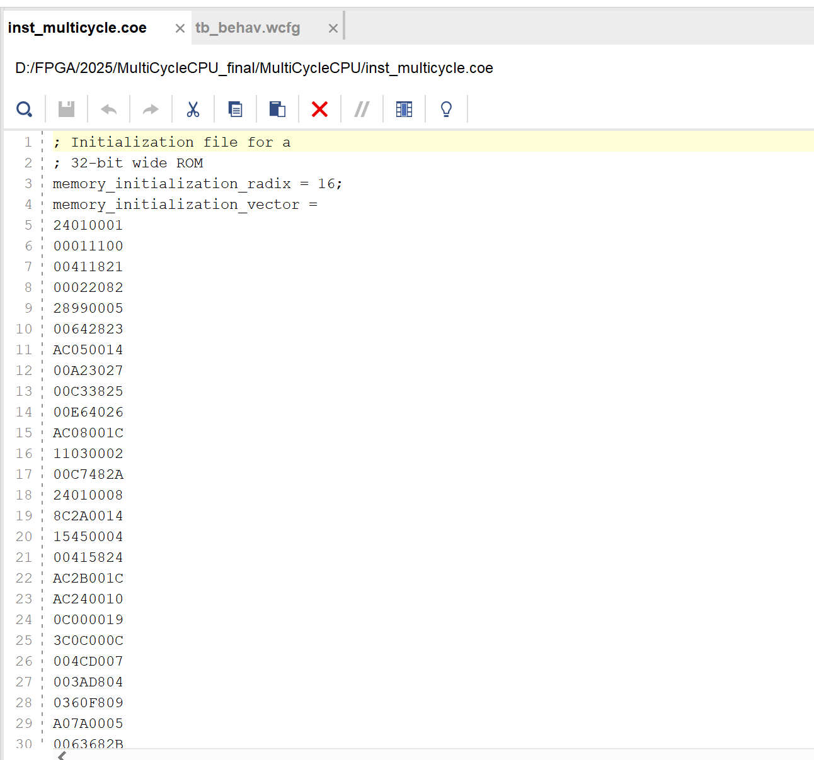
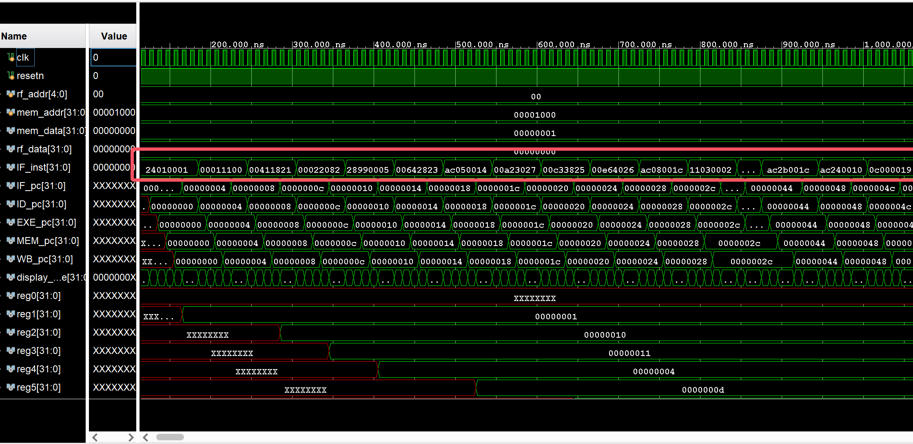
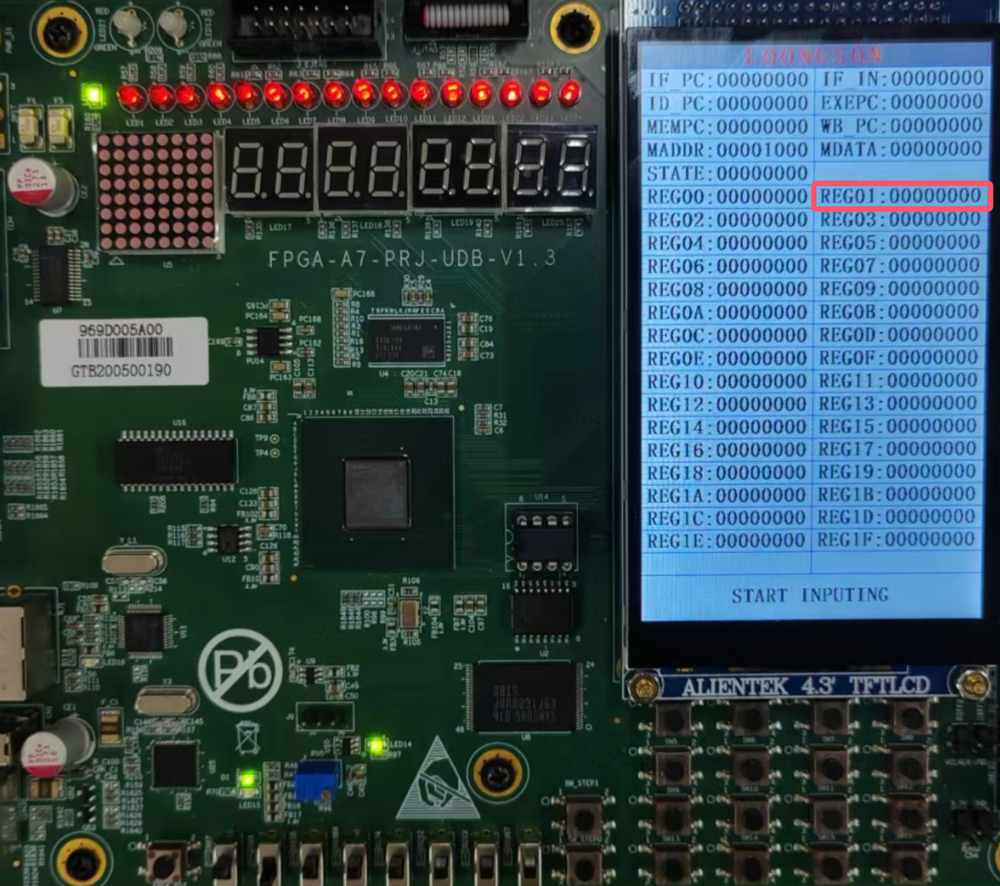
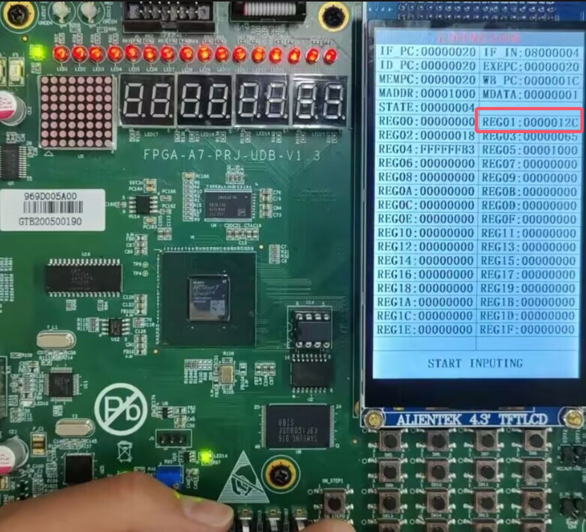
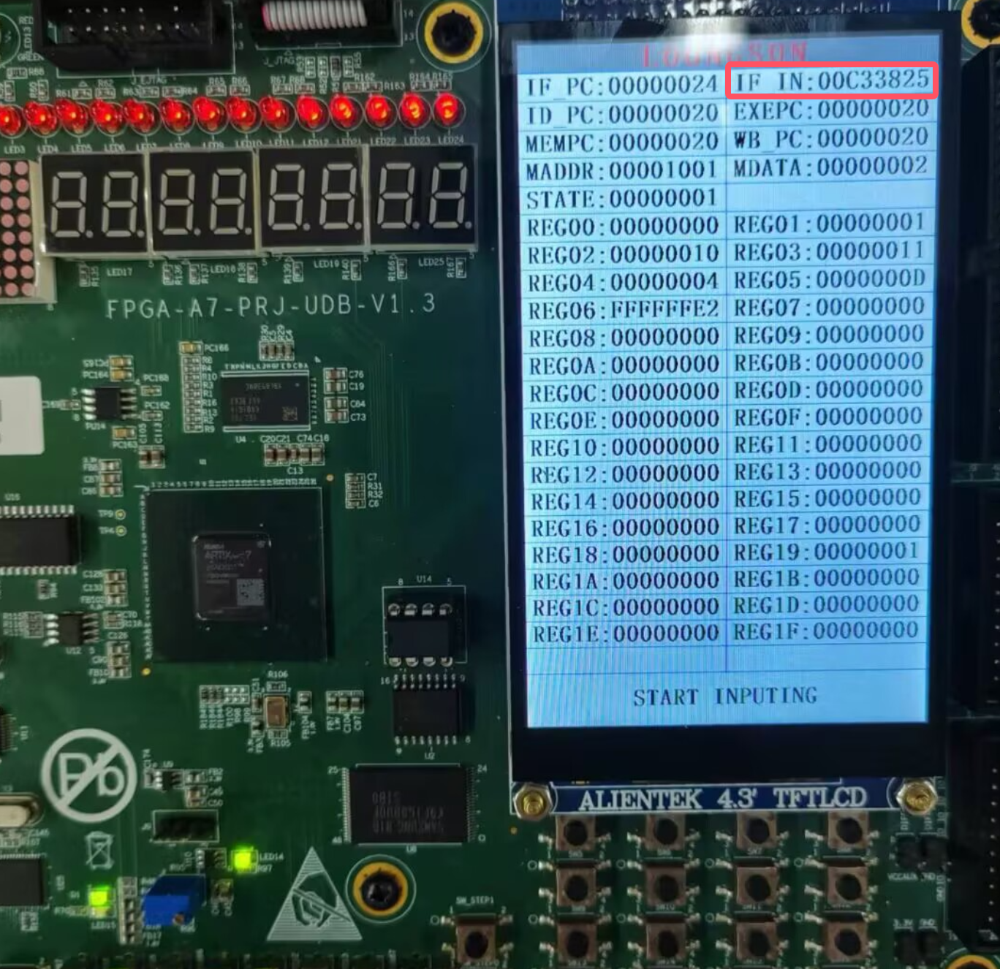
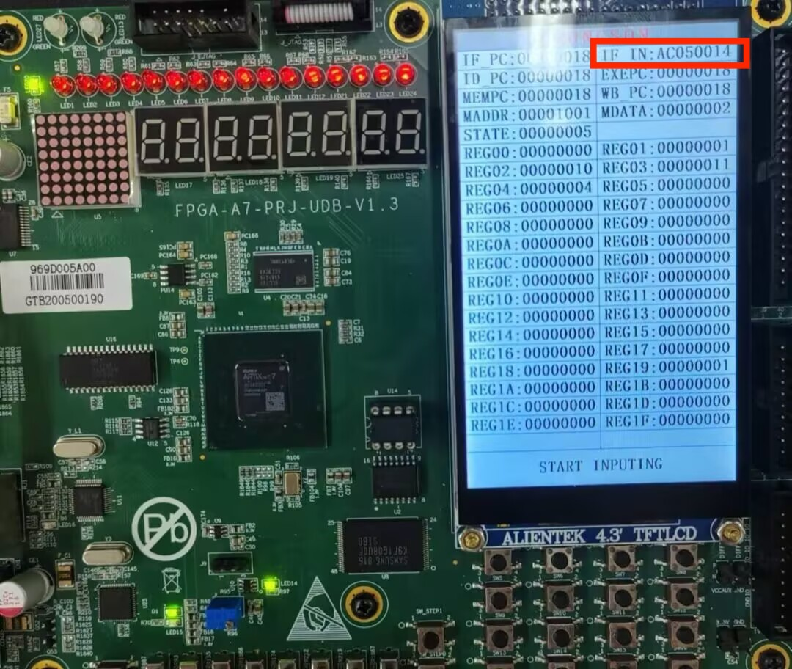
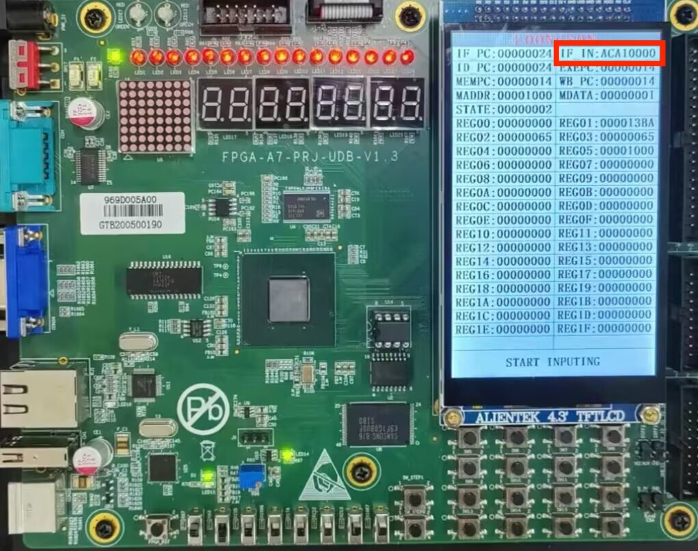
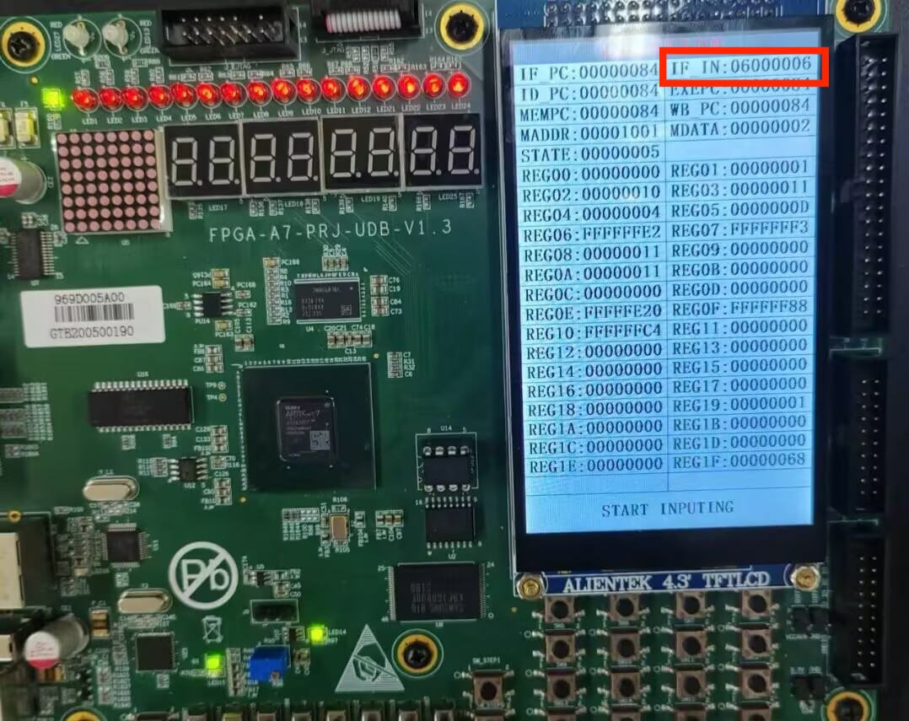
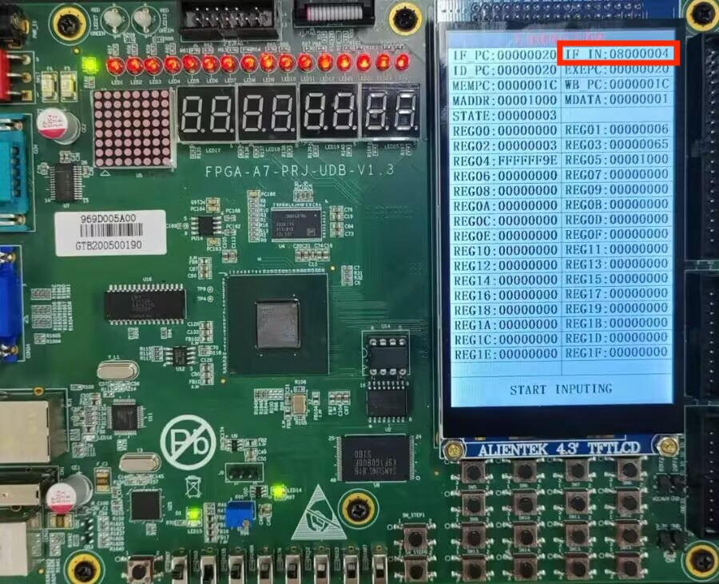
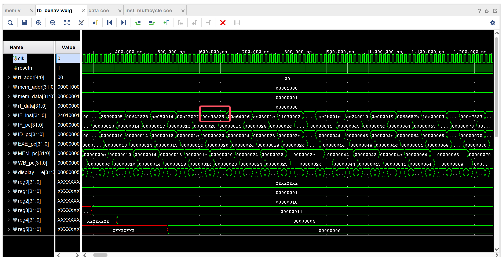

<style>
  .title {
    text-align: center;
    margin: 20px 0;
  }
  
  .content-wrapper {
    min-height: calc(100vh - 100px);
    position: relative;
  }
  
  .school-name {
    text-align: center;
    margin-top: 200px;
  }
</style>


<style>
  /* 代码块样式 */
  .code-block {
    margin-left: 2em;
  }
  .code-block pre {
    background-color: #f5f5f5 !important;
    padding: 1em;
    border-radius: 4px;
    margin: 1em 0;
  }

  /* 页码样式 */
  .page-number {
    position: running(pageNumber);
    text-align: center;
  }
  
  @page {
    margin: 1in;
    @bottom-center {
      content: counter(page);
    }
  }

  /* 首页和目录页不显示页码 */
  .no-page-number {
    page: no-number;
  }
  @page no-number {
    @bottom-center {
      content: none;
    }
  }
</style>

<div class="content-wrapper">

<div class="title">

# 计算机组成原理实验报告

## 作业名称：多周期CPU设计个人实验报告

</div>

- **姓名**：饶甜甜
- **专业班级**：2023级计算机科学与技术⼀班
- **学号**：320230943420
- **指导教师**：何安平
- **实验⽇期**：2025年3⽉17⽇-3⽉30⽇

<div class="school-name">
兰州大学信息科学与工程学院
</div>

---
<!-- 分页符 -->
<div style="page-break-after: always"></div>


[toc]

---
<!-- 分页符 -->
<div style="page-break-after: always"></div>
<style>
  h1 {
    text-align: center;
    font-size: 2em; 
  }
</style>


## 1 引言
本报告主要阐释我在本次实验中所做的贡献以及学习到的知识和收获。

## 2 实验目的与设计概览
### 2.1 实验目的
本实验旨在设计一个支持32位MIPS指令集架构的多周期处理器，通过使用Verilog硬件描述语言实现处理器的基本功能，如指令取码、译码、执行、访存和写回。其中，我主要负责存储与数据访问相关模块的设计与实现。

具体实验目的包括：
1. 理解多周期处理器的基本原理和结构，包括如何优化指令执行与资源利用效率
2. 学习掌握使用Verilog进行硬件设计和描述，包括模块化设计、状态机实现和时序控制等基本要素
3. 通过设计状态机、ALU以及数据通路，探究并实现高效的指令执行流程和资源调度机制
4. 使用Vivado软件进行仿真，生成比特流文件，部署到FPGA实验箱上，实现实际功能演示
5. 在实验过程中，锻炼与他人合作的能力，共同解决设计与实现中的问题，分享设计思路及实现过程中遇到的挑战
### 2.2 设计概览

我们的多周期CPU设计项目的层次结构采用了经典的五级流水线架构，主要包含以下模块：

1. **多周期CPU (multi_cycle_cpu)**：核心处理器模块，包含以下子模块：
   - **IF模块 (fetch.v)**：指令获取阶段
   - **ID模块 (decode.v)**：指令解码阶段
   - **EXE模块 (exe.v)**：执行阶段，包含：
     - **ALU模块 (alu.v)**：算术逻辑单元，包含：
       - **加法器模块 (adder.v)**：用于算术计算
   - **MEM模块 (mem.v)**：内存访问阶段
   - **WB模块 (wb.v)**：写回阶段

2. **指令和数据存储**：
   - **指令ROM (inst_rom)**：存储程序指令
   - **数据RAM (data_ram)**：存储数据
   - **寄存器文件 (regfile.v)**：CPU寄存器组

3. **外设**：
   - **LCD模块**：显示输出接口

4. **其他文件**：
   - 约束文件 (constrs_1)：硬件约束定义
   - 仿真测试文件 (tb.v)：测试台代码
  
## 3 个人贡献
在本次多周期CPU设计实验中，我负责的工作包括：
1. 存储与数据访问相关模块的实现
   - 设计并实现存储器访问模块（mem.v）
   - 设计并实现写回模块（wb.v）
   - 配置指令存储器模块（inst_rom.xci）
   - 配置数据存储器模块（data_ram.xci）
2. 存储器配置与测试
   - 负责存储器COE文件的生成与配置
   - 进行相关仿真验证工作
   - 参与上板测试和调试

## 4 设计原理
### 4.1 存储器访问模块设计`mem.v`
在本次实验中，我负责了设计访存模块，这是多周期CPU执行过程中的第四个阶段。访存模块主要处理与内存交互的指令，如加载字（LW）和存储字（SW）等操作。

#### 4.1.1 模块功能概述
- **核心功能**：
  - 内存访问：处理LW/SW（字操作）和LB/SB（字节操作）指令
  - 数据对齐与扩展：处理非对齐字节访问，支持符号/零扩展
  - 流水线同步：处理同步存储器的读取延迟，确保访存阶段时序正确
- **输入输出**：
  - 输入：`clk/MEM_valid`、`EXE_MEM_bus_r`、`dm_rdata`
  - 输出：`dm_addr`、`dm_wen/dm_wdata`、`MEM_WB_bus`、`MEM_over`、`MEM_pc`

#### 4.1.2 总线拆分设计
我设计的mem.v模块首先从执行阶段传递的总线中提取所需的各种控制信号和数据：

```verilog
assign {mem_control, store_data, alu_result, rf_wen, rf_wdest, pc} = EXE_MEM_bus_r;
```

这种设计使得总线信号能够被清晰地解析为各个控制信号和数据值，便于后续处理。

#### 4.1.3 内存访问控制逻辑
我实现的关键功能是内存访问控制逻辑，包括：

```verilog
assign {inst_load, inst_store, ls_word, lb_sign} = mem_control;
assign dm_addr = alu_result;
```

写使能信号生成根据指令类型（字/字节）和地址低2位决定，实现了对不同字节的选择性写入。对于字操作，启用4个字节的写使能；对于字节操作，根据地址低2位选择相应字节的写使能。

#### 4.1.4 数据对齐与扩展处理
我设计了数据对齐与扩展机制，处理不同粒度的数据操作：

写数据时，对于字节存储，根据地址低2位将字节数据放置在32位字的正确位置：
```verilog
dm_wdata = {24'd0, store_data[7:0]}; // 字节在最低位的情况
```

读数据时，先根据地址低2位提取所需字节，再根据指令类型进行符号扩展或零扩展：
```verilog
load_result = ls_word ? dm_rdata : (lb_sign ? {{24{load_sign}}, load_byte} : {24'd0, load_byte});
```

#### 4.1.5 访存完成标志生成
我设计了访存完成标志的生成逻辑，确保访存阶段正确结束和流水线推进：

```verilog
always @(posedge clk) MEM_valid_r <= MEM_valid;
assign MEM_over = inst_load ? MEM_valid_r : MEM_valid;
```

这部分设计保证了对于加载指令，由于数据存储器是同步读取的，需要等待一个时钟周期；而存储指令或不涉及访存的指令可以立即完成。

#### 4.1.6 结果总线构建
我设计的MEM模块最后将处理结果封装到总线中，传递给写回阶段：

```verilog
wire [31:0] mem_result = inst_load ? load_result : alu_result;
assign MEM_WB_bus = {rf_wen, rf_wdest, mem_result, pc};
```

这一设计确保了针对不同类型指令，选择正确的结果（访存指令使用load_result，非访存指令使用alu_result）传递给写回阶段，同时携带必要的控制信号。

### 4.2 写回模块设计`wb.v`
作为多周期CPU的最后一个阶段，写回模块（Write Back）负责将指令执行或访存的结果写回到寄存器堆。我设计实现的wb.v模块较为简单但至关重要。

#### 4.2.1 模块功能概述
- **定位**：作为流水线的写回阶段（WB），接收来自访存阶段（MEM）的结果，并将有效数据写回寄存器堆
- **核心任务**：
  - 解析MEM阶段传递的总线信号
  - 生成寄存器堆的写控制信号（使能、地址、数据）
  - 标记写回阶段完成状态
  - 提供当前PC值用于调试或显示

#### 4.2.2 总线拆分与信号处理
我的设计首先对从访存阶段传来的总线进行解析：
```verilog
wire wen;
wire [4:0] wdest;
wire [31:0] mem_result;
wire [31:0] pc;    
assign {wen, wdest, mem_result, pc} = MEM_WB_bus_r;
```

在我的设计中，MEM_WB_bus直接传递经过MEM阶段处理后的最终结果mem_result。这种设计更为简洁，因为MEM阶段已经进行了结果选择。

#### 4.2.3 结果选择与写回控制
写回模块的关键功能是生成写回控制信号：
```verilog
assign rf_wen   = wen & WB_valid;
assign rf_wdest = wdest;
assign rf_wdata = mem_result;
```

在我的实际设计中：
1. 寄存器写使能由总线中的wen信号与WB_valid共同控制，确保只有在写回阶段有效且指令需要写回时才进行写操作
2. 写回地址直接来自总线传递的wdest
3. 写回数据直接使用mem_result，因为MEM阶段已经完成了数据选择（无论是ALU结果还是内存读取结果）

这种简化设计避免了通过比较mem_result和alu_result来选择写回数据的复杂逻辑，使代码更为简洁高效。

#### 4.2.4 写回完成标志
写回阶段作为流水线的最后一个阶段，其完成标志直接由有效信号驱动：
```verilog
assign WB_over = WB_valid;
assign WB_pc = pc;
```

这部分设计确保了：
1. 写回阶段可以在一个时钟周期内完成，WB_valid即是WB_over信号
2. 当WB_over有效时，表示写回已完成，CPU可以继续处理下一条指令
3. 输出当前PC值用于调试和监控

我的写回模块设计通过最少的逻辑实现了指令结果的正确写回，为CPU的整体功能提供了可靠保障。

### 4.3 存储器配置与设计
我负责配置的数据存储器和指令存储器使用了Xilinx IP核，需要进行特定的参数配置和初始化。

#### 4.3.1 指令存储器配置
指令存储器（inst_rom.xci）的主要配置参数如下：
- 内存类型：单端口ROM
- 深度：16KB（4096×32位字）
- 宽度：32位
- 初始化：使用COE文件

我创建了COE文件用于初始化指令存储器，包含测试程序的机器码，主要有三种：
1. 简单递增数据测试文件（data.coe）
2. 复杂指令集测试文件（inst_multicycle.coe）
3. 循环累加测试文件（inst_test.coe）

#### 4.3.2 数据存储器配置
数据存储器（data_ram.xci）的主要配置参数如下：
- 内存类型：双端口RAM（一个端口用于CPU访问，一个端口用于调试）
- 深度：16KB（4096×32位字）
- 宽度：32位
- 读取延迟：1个时钟周期
- 写使能：支持字节级写使能

这种配置确保了：
1. CPU可以进行字、半字和字节级访问
2. 读操作需要1个时钟周期，符合多周期设计的时序要求
3. 外部调试接口可以监视内存内容


### 4.4 其他模块概述

本节简要介绍由其他组员负责实现的模块，以提供完整的系统视图。

#### 4.4.1 取指模块（fetch.v）
取指模块负责从指令存储器中获取下一条要执行的指令。其主要功能包括：
- PC管理：根据跳转信号或顺序执行来更新程序计数器
- 指令预取：从指令存储器读取指令并传递给译码阶段
- 时序控制：处理指令存储器的读取延迟，确保取指阶段与流水线其他阶段协调一致

取指模块接收跳转总线信号（jbr_bus），根据跳转条件决定是加载跳转目标地址还是顺序递增PC值，从而实现程序流控制。

#### 4.4.2 译码模块（decode.v）
译码模块负责解析从取指阶段获取的指令，并产生后续阶段所需的控制信号。其主要功能包括：
- 指令解析：将指令分解为操作码、寄存器地址、功能码和立即数等字段
- 指令类型识别：区分R型、I型和J型指令
- 操作数准备：处理立即数扩展（符号/零扩展）和寄存器读取
- 跳转逻辑：生成条件跳转和无条件跳转的控制信号
- 控制信号生成：为ALU、访存和写回阶段产生控制信号

译码模块具有关键的跳转分支逻辑，可分析和处理BEQ、BNE、J和JAL等指令，并生成适当的跳转总线信号。

#### 4.4.3 执行模块（exe.v）
执行模块是多周期CPU的核心计算单元，负责指令的实际执行。其主要功能包括：
- 操作数选择：根据译码阶段的控制信号选择ALU的输入操作数
- ALU操作：执行算术、逻辑、移位和比较等操作
- 地址计算：计算分支和跳转指令的目标地址
- 结果传递：准备访存地址或写回数据

执行模块内部包含ALU子模块，支持12种不同的操作（如加法、减法、位与、位或、移位等），通过独热码控制信号选择执行的具体操作类型。

#### 4.4.4 寄存器堆模块（regfile.v）
寄存器堆模块实现MIPS架构的32个通用寄存器，支持同步写入和异步读取操作。其主要功能包括：
- 同步写：在时钟上升沿写入数据（受写使能控制）
- 异步读：组合逻辑实现的双端口读取（支持同时读取两个寄存器）
- 寄存器0保护：确保寄存器0（$0）始终保持为0
- 调试接口：提供额外的读端口用于外部监视寄存器内容

寄存器堆设计支持前递机制，可以在同一周期内将正在写入的值直接转发给读操作，减少数据冒险。

#### 4.4.5 顶层控制模块（multi_cycle_cpu.v）
顶层控制模块负责协调各个功能模块的工作，并实现状态机控制。其主要功能包括：
- 状态机管理：控制CPU在IDLE、FETCH、DECODE、EXE、MEM和WB六个状态间的转换
- 模块使能：根据当前状态生成各功能模块的使能信号
- 数据锁存：在各阶段间锁存数据总线，确保数据正确传递
- 总线管理：协调各模块间的数据和控制信号传递
- 调试信息：输出各阶段的PC值和状态信息，便于调试

顶层模块通过状态转移逻辑和阶段完成信号（如IF_over、ID_over等）控制CPU的执行流程，确保指令按照取指、译码、执行、访存和写回的顺序依次执行。

#### 4.4.6 显示模块（multi_cycle_cpu_display.v）
显示模块为上板实现提供了接口，负责处理时钟信号、复位信号及与触摸屏的交互。其主要功能包括：
- 单步时钟生成：使用按钮控制单步执行，便于调试
- 多周期CPU实例化：连接CPU与外部接口
- 触摸屏接口：配置显示内容，包括寄存器值、PC值和CPU状态
- 输入处理：接收用户通过触摸屏输入的内存地址和寄存器选择

显示模块使CPU能够在实验箱上可视化运行，是调试和演示系统功能的重要组件。

## 5 仿真与实现

### 5.1 存储器访问模块`mem.v`的仿真验证
我对mem模块进行了多种指令类型的仿真测试，重点验证了以下功能：

#### 5.1.1 加载字指令`LW`测试
```verilog
// 测试场景：加载字指令
// 输入：
//   - MEM_valid = 1
//   - mem_control = 4'b0100（加载字）
//   - alu_result = 32'h1000（内存地址）
//   - dm_rdata = 32'h12345678（内存返回数据）
// 预期输出：
//   - MEM_over = 1（延迟一个周期后）
//   - MEM_WB_bus中包含mem_result = 32'h12345678
```

仿真结果显示，MEM模块正确处理了加载指令，在一个时钟周期后生成MEM_over信号，并将加载的数据传递到写回总线。

#### 5.1.2 存储字指令`SW`测试
```verilog
// 测试场景：存储字指令
// 输入：
//   - MEM_valid = 1
//   - mem_control = 4'b1000（存储字）
//   - alu_result = 32'h1004（内存地址）
//   - store_data = 32'h87654321（待存储数据）
// 预期输出：
//   - MEM_over = 1（立即）
//   - dm_wen = 1
//   - dm_addr = 32'h1004
//   - dm_wdata = 32'h87654321
```

仿真结果表明，MEM模块正确生成了内存写使能和地址信号，并立即生成了MEM_over信号，无需等待写入完成。

#### 5.1.3 字节加载指令`LB`测试
```verilog
// 测试场景：加载字节并符号扩展
// 输入：
//   - MEM_valid = 1
//   - mem_control = 4'b0101（加载字节并符号扩展）
//   - alu_result = 32'h1003（内存地址，非对齐）
//   - dm_rdata = 32'h12345678（内存返回数据）
// 预期输出：
//   - MEM_over = 1（延迟一个周期后）
//   - MEM_WB_bus中包含mem_result = 32'hFFFFFF12（符号扩展的结果）
```

仿真验证了模块对非对齐字节访问的正确处理，以及符号扩展功能的实现。

### 5.2 写回模块`wb.v`的仿真验证
我对写回模块进行了多种指令类型的仿真验证：

#### 5.2.1 算术指令写回测试
```verilog
// 测试场景：算术指令结果写回
// 输入：
//   - WB_valid = 1
//   - wen = 1
//   - wdest = 5'd10（目标寄存器$10）
//   - alu_result = 32'h00000064（加法结果100）
//   - mem_result = 32'h00000064（与ALU结果相同，表示非加载指令）
// 预期输出：
//   - rf_wen = 1
//   - rf_wdest = 5'd10
//   - rf_wdata = 32'h00000064（ALU结果）
//   - WB_over = 1
```

仿真结果表明，WB模块正确生成了寄存器写信号，并选择了ALU结果作为写回数据。

#### 5.2.2 加载指令写回测试
```verilog
// 测试场景：加载指令结果写回
// 输入：
//   - WB_valid = 1
//   - wen = 1
//   - wdest = 5'd5（目标寄存器$5）
//   - alu_result = 32'h00001000（内存地址）
//   - mem_result = 32'h12345678（从内存加载的数据）
// 预期输出：
//   - rf_wen = 1
//   - rf_wdest = 5'd5
//   - rf_wdata = 32'h12345678（内存加载的数据）
//   - WB_over = 1
```

仿真验证了WB模块能够正确识别加载指令，并选择内存访问结果作为写回数据。

### 5.3 存储器COE文件测试
我实现的存储器COE文件在仿真和上板测试中都表现良好：

#### 5.3.1 基础存储功能测试
`data.coe`文件包含简单递增数据，测试了存储器的基本读写功能：
- 测试内容：`0x00000001`至`0x00000008`的连续递增数据
- 测试结果：内存地址`0x14`的值正确读取为`0x00000005`，在最初的上板过程中能够正确显示。

#### 5.3.2 综合指令集测试
`inst_multicycle.coe`文件包含覆盖R型、I型和J型的完整指令集，检验主要放在仿真部分，仿真结果显示所有指令都能正确执行，观察到的IF_inst值与COE文件内容完全一致，指令正确被加载到内存并执行，如下图所示：

**综合测试指令集`inst_multicycle.coe`：**
<center>
   
</center>

**仿真结果：**
<center>
   
</center>


#### 5.3.3 循环累加测试
这一部分的测试中，我使用C语言编写简单程序实现了1加到100的过程，覆盖到CPU所支持的分指令，使用MIPS交叉编译为汇编源码，使用MIPS模拟器翻译为了机器指令存储在**第三个coe文**`inst_test.coe`进行上板部署测试。上板测试结果如下图所示：


- **实验箱初始状**
  REG01:00000000 // 0
  
<center>
  
</center>

- **执行过程中间状态**
  REG01:0000012C // 300

<center>
  
</center>

- **结果显示**
  REG01:000013BA // 5050

<center>
  
</center>
最终计算结果为5050，结果正确。

并且我设计的该上板测试机器码覆盖到了所有CPU所支持的分指令，以下为举例展示：
- **R型指令** ：00C33825 // 寄存器间按位或操作
<center>
  
</center>

- **I型指令(计算类)** ：21290001 // 立即数运算
<center>
  

</center>

- **I型指令(取数类)** ：AC050014 // 从内存地址 0x00050014 加载数据到寄存器 $a1
<center>
  
</center>

- **I型指令(存数类)** ：ACA10000 // 存储数据到内存地址 0xA0100000
<center>
  
</center>

- **I型指令(条件判断)** ：06000006 // 条件分支
  
<center>
  
</center>

- **J型指令** ：08000004 // 跳转到地址 0x00000010
<center>
  
</center>

上板测试结果完全符合预期，验证了我设计的存储器访问模块和写回模块的正确性，以及整个CPU处理器的功能完备性。

## 6 思考题回答

### 6.1 多周期CPU与单周期CPU阶段划分的区别及控制方式

多周期CPU和单周期CPU在五个阶段（取指、译码、执行、访存、写回）的划分上存在以下主要区别：

#### 6.1.1 单周期与多周期CPU阶段划分的区别

1. **时序划分**：
   - 单周期CPU：所有五个阶段在一个时钟周期内完成，指令执行时间固定为最长指令的执行时间。
   - 多周期CPU：每个阶段占用一个或多个时钟周期，不同指令可能需要不同数量的周期完成。

2. **资源利用**：
   - 单周期CPU：各功能部件只使用一次后就空闲等待下一条指令。
   - 多周期CPU：同一功能部件可以在一条指令执行的不同阶段重复使用，资源利用率更高。

3. **时钟频率**：
   - 单周期CPU：时钟周期由最长指令的延迟决定。
   - 多周期CPU：时钟周期由单个阶段中最长的操作决定，通常可以运行在更高频率。

4. **控制信号生成**：
   - 单周期CPU：控制信号由指令直接产生，一次性生成所有阶段所需信号。
   - 多周期CPU：控制信号由当前状态和指令共同决定，每个时钟周期只生成当前阶段所需信号。

#### 6.1.2 多周期CPU如何控制五个阶段的依次执行

多周期CPU通过状态机来控制五个阶段的依次执行：

1. **状态定义**：
   根据实验报告中的代码，多周期CPU定义了五个主要状态：IDLE、FETCH、DECODE、EXE、MEM和WB。

2. **状态转换**：
   每个阶段完成后会通过状态转换信号（如IF_over、ID_over等）指示当前阶段已完成，控制状态机进入下一状态。

3. **控制总线**：
   各阶段之间通过总线（如IF_ID_bus、ID_EXE_bus等）传递数据和控制信号，实现阶段间的协调。

4. **时序控制**：
   每个时钟上升沿，状态机检测当前阶段完成标志，决定是否更新状态和锁存数据到下一阶段。

### 6.2 结合具体指令的数据通路和控制通路分析

比如说R型指令`00C33825`，在仿真波形图中有完整的执行过程显示，仿真结果如下图：

<center>
  
</center>

具体按照多周期CPU的五个阶段来讲，该指令的执行过程如下：

#### 6.2.1 取指阶段（FETCH）

**数据通路**：
- 波形图显示IF_pc为0x00000020，表示指令"00C33825"存储在PC=0x20的位置
- IF_inst信号加载了值"00C33825"，确认成功从指令存储器中取出了目标指令
- PC值在时钟边沿更新，准备下一条指令的获取

**控制通路**：
- 时钟信号(clk)为取指提供时序控制
- CPU状态机从IDLE切换到FETCH状态
- 指令地址被发送到指令ROM，ROM返回指令字"00C33825"
- 取指完成后，IF_over信号置高，触发状态切换到DECODE

#### 6.2.2 译码阶段（DECODE）

**数据通路**：
- 波形图中ID_pc同步更新为0x00000020，确认当前处理的是PC=0x20的指令
- 指令"00C33825"被解析：
  - op=0（表示R型指令）
  - rs=6（$a2）
  - rt=3（$v1）
  - rd=7（$a1）
  - funct=25（OR操作）
- 寄存器堆并行读取rs和rt的值（从波形图中可以看到reg6和reg3的值）

**控制通路**：
- ID_valid信号激活后，译码器开始工作
- 通过指令解码，生成了ALU控制信号（对应OR操作）
- 设置rf_wen（寄存器写使能）和rf_wdest（寄存器写地址，此处为$a1）
- ID_over信号触发状态转换到EXE阶段

#### 6.2.3 执行阶段（EXE）

**数据通路**：
- 波形图中EXE_pc更新为0x00000020，表示执行阶段处理的仍是该指令
- ALU接收两个操作数：
  - 操作数1：寄存器$a2的值
  - 操作数2：寄存器$v1的值
- ALU根据控制信号执行OR操作，结果将在波形图中的后续周期体现

**控制通路**：
- EXE_valid信号有效，激活执行模块
- ALU控制信号指示执行OR操作
- ALU计算完成后，EXE_over信号触发状态转换到MEM阶段
- 执行结果与控制信号通过EXE_MEM_bus传递到内存访问阶段

#### 6.2.4 访存阶段（MEM）

**数据通路**：
- 波形图中MEM_pc更新为0x00000020，继续跟踪该指令
- 由于OR指令不需要访问内存，ALU结果直接传递
- 内存控制信号表明不执行读/写操作

**控制通路**：
- MEM_valid信号激活访存模块
- mem_control信号指示不需要内存操作
- MEM_over信号在访存逻辑（即便是空操作）完成后触发，状态切换到WB阶段
- 结果和控制信号通过MEM_WB_bus传递到写回阶段

#### 6.2.5 写回阶段（WB）

**数据通路**：
- 波形图中WB_pc更新为0x00000020，确认写回阶段处理的仍是该指令
- 可以在波形图中观察到寄存器变化：reg7（即$a1）的值被更新为$a2和$v1的OR结果
- 从波形图可以看到reg值的变化发生在WB阶段结束时

**控制通路**：
- WB_valid信号激活写回模块
- rf_wen（寄存器写使能）信号置高
- rf_wdest指定写回的目标寄存器为$a1（编号7）
- WB_over信号触发状态机回到IDLE状态，准备执行下一条指令

#### 6.2.6 其他仿真结果解析：

1. **数据传递**：
   - 波形图清晰展示了指令在各个阶段的流动，IF_pc → ID_pc → EXE_pc → MEM_pc → WB_pc，都显示了值0x00000020
   - 各阶段PC值的传递证实了多周期CPU中数据的锁存和传递机制

2. **时序控制**：
   - 从波形图可见每个阶段都占用至少一个时钟周期
   - 状态转换严格发生在时钟上升沿，体现了多周期CPU的同步控制特性

3. **寄存器值变化**：
   - 波形图显示reg7（$a1）的值在指令完成写回阶段后更新
   - 这说明寄存器写操作确实发生在写回阶段完成时

我们可以清晰看到指令"00C33825"在多周期CPU中的完整执行过程，各阶段间的数据传递和控制信号变化与理论设计一致，验证了多周期CPU的正确工作模式和OR指令的执行流程。

### 6.3 多周期CPU设计的整体思路

多周期CPU设计的整体思路是从状态机入手，然后逐步推进实现各个模块：

1. **设计入手点**：
   - 首先设计状态机控制逻辑，确定五个主要状态（IDLE、FETCH、DECODE、EXE、MEM、WB）
   - 定义各状态间的转换条件和时序
   - 划分模块和子模块的功能边界

2. **推进设计过程**：
   - 基础设施构建：设计寄存器堆、ALU等基本运算单元
   - 通路设计：规划数据通路和控制通路
   - 模块实现：按照数据流向，依次实现各功能模块（fetch、decode、exe、mem、wb）
   - 总线设计：定义模块间的通信总线格式和内容
   - 集成测试：将各模块集成，并进行仿真验证

3. **功能验证**：
   - 使用单一指令测试各模块功能
   - 构建指令集测试验证不同类型指令的执行
   - 最终实现综合应用（如累加计算）验证整体功能

### 6.4 扩展练习题——访存时序调整

CPU中需要使用同步RAM而不是异步RAM，要保证流水线不因访存而停顿，需要调整多周期CPU的访存时序：

**访存时序调整思路**：

1. **问题分析**：
   - 同步RAM在时钟上升沿才能给出读取结果，无法在同一周期内完成读取和使用
   - 传统多周期设计中，访存阶段需要等待内存返回数据才能进入下一阶段

2. **调整方法**：

   a. **指令预取**：
   - 在取指阶段，启动指令读取但不等待完成
   - 在下一个时钟上升沿，指令数据才可用
   - 通过增加一个缓冲周期或流水线寄存器来存储指令

   b. **数据访存优化**：
   - 对于Load指令，在EXE阶段计算地址并发起内存读取请求
   - MEM阶段获取内存返回的数据
   - 需要确保地址计算和数据读取有足够的时间间隔

   c. **写入操作优化**：
   - Store指令的数据写入需在MEM阶段启动
   - 使用写缓冲区（write buffer）减少写入延迟对CPU的影响

3. **具体实现**：
   - 修改fetch.v模块，增加指令预取逻辑
   - 在mem.v模块中，调整Load指令的数据读取时序
   - 增加必要的缓冲寄存器，确保数据在下一周期可用
   - 状态机可能需要增加额外状态以处理内存访问延迟

这些调整能确保CPU在使用同步RAM的情况下，仍能保持流水线的连续执行，避免因访存操作导致的停顿。

总之，多周期CPU通过状态机和各个专用模块的协同工作，实现了指令的分阶段执行，提高了资源利用率和执行效率。与单周期CPU相比，多周期CPU能更好地平衡性能和资源占用，为后续流水线CPU的设计奠定了基础。

## 7 收获、反思与改进

### 7.1 收获
- 通过这次多周期CPU的设计实验，我收获了很多。在设计访存模块和写回模块的过程中，我逐渐深入理解了多周期CPU的工作原理。特别是在处理访存模块时，学会了如何根据指令类型生成不同的内存控制信号，以及如何处理字和字节级别的数据访问。
- 写回模块虽然逻辑简单，但它作为指令执行的最后一步，对于确保指令结果正确写入寄存器至关重要。
- 在技术层面上，我加深了对Verilog硬件描述语言的理解和应用能力。通过编写这些模块的代码，我学会了如何设计时序逻辑、如何合理组织总线信号，以及如何确保各模块之间的正确配合。尤其是在设计访存模块时，处理不同数据的对齐和扩展问题让我对计算机硬件的底层工作机制有了更清晰的认识。
- 团队协作是这次实验的另一大收获。我们小组成员各自负责不同的模块，这要求我们对接口和时序信号有统一的理解。在调试过程中，我们经常一起分析波形图，找出模块间配合的问题。有时候我的模块出现了问题，其他同学也会帮忙排查，这种互助的经历让我体会到了团队协作的重要性。

### 7.2 问题与反思
在实验中我也遇到了很多挑战。一开始，我对总线信号的理解不够清晰，导致访存模块的行为与预期不符。在调试过程中，我发现原来是我错误地解析了来自执行阶段的控制信号。经过多次修改和测试，才最终确保了模块的正确工作。这个过程虽然困难，但让我学会了如何系统地分析和解决问题。

### 7.3 未来改进方向
基于本次实验的经验，我认为在下次实验中我会更加有经验。下一次的实验内容是向CPU中添加异常和中断处理机制。目前的设计中，当访存地址非法或指令不合法时，CPU无法做出适当的响应。增加异常处理机制后，可以在遇到非法访存地址时触发地址异常，并跳转到异常处理程序。同时，添加中断机制也很重要，这样CPU就能响应外部设备的请求，实现与外设的交互。这将需要在状态机中增加异常状态和中断响应状态，并在访存和写回模块中增加相应的异常检测逻辑。例如，在访存模块中可以检测地址对齐异常和访问权限异常，在写回阶段可以更新异常状态寄存器。这些改进将使我们的CPU更加完善，也更接近实际应用的处理器设计。

通过本次多周期CPU的设计与实现，我不仅完成了负责的存储访问和写回模块，还对处理器架构有了更深入的理解。这些经验将对未来更复杂的系统设计（如流水线CPU或多核系统）奠定坚实的基础。